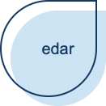

<!-- README.md is generated from README.Rmd. Please edit that file -->

```{r, include = FALSE}
knitr::opts_chunk$set(
  collapse = TRUE,
  comment = "#>",
  fig.path = "man/figures/README-",
  out.width = "100%"
)
```



# A Package for Exploratory Data Analysis (edar)

<!-- badges: start -->
[](https://github.com/UBC-MDS/edar/actions)
[](https://codecov.io/gh/UBC-MDS/edar)
<!-- badges: end -->

## Summary

Exploratory Data analysis is an important step in any data analysis. There are some general steps like describing the data, knowing `NA` values and plotting the distributions of the variables  which are performed to understand the data well. All these tasks require a lot of coding effort. The package tries to address this issue by providing a single function which will generate a general exploratory data analysis report. This report will contain the distribution plots of categorical and numerical variables, correlation matrix and a numerical and graphical representation to understand and identify `NA` values.

## Package positioning

The package helps in the EDA process of data analysis. There are other similar package which can be used for EDA analysis. A package which does a similar thing is [DataExplorer](https://www.rdocumentation.org/packages/DataExplorer/versions/0.8.1). The package scans and
analyzes each variable, and visualizes them with typical graphical techniques.

## Functions

1. `calc_cor`: This function takes in a data frame and numeric variable names and returns the correlation matrix for numerical variables.
2. `describe_na_values` : This function takes in a data frame and returns a table listing with the number of NA values in each feature.
3. `describe_cat_var`: This function takes in a data frame and categorical variable names and returns the histogram of each categorical variable.
4. `describe_num_var`: This function takes in a data frame and numerical variable names and returns the histogram of each numerical variable and summary statistics such as the mean, median, maximum and minimum for the numeric variables.
5. `generate_report`: This is a wrapper function which generates an EDA report by plotting graphs and tables for the numeric variables, categorical variables, NA values and correlation in a data frame.

## Installation

You can download, build and install this package from [GitHub](https://github.com/) with:

``` r
# install.packages("devtools")
devtools::install_github("UBC-MDS/edar")
```

## Dependencies
- R version 3.6.2 and R packages:
  - rlang==0.4.2
  - dplyr==0.8.3
  - tibble==2.1.3
  - purrr==0.3.3
  - ggplot2==3.2.1
  - tidyr==1.0.0
  - ggcorrplot==0.1.3
  - testthat==2.1.0 

## Example

This is a basic example which shows you how to solve a common problem:

```{r example}
library(edar)
X <- dplyr::tibble(type = c('Car', 'Bus', 'Car'), height = c(10, 20, 15), width = c(10, 15, 13))

# Evaluates a dataframe for NA values
describe_na_values(X)

# Show the EDA for the numeric variables
num_result <- describe_num_var(X, c('height', 'width'))
num_result$summary
num_result$plot

# Show the EDA for the categorical variables
describe_cat_var(X, c('type'))

# Plot the correlation matrix
calc_cor(X, c('height', 'width'))
```
